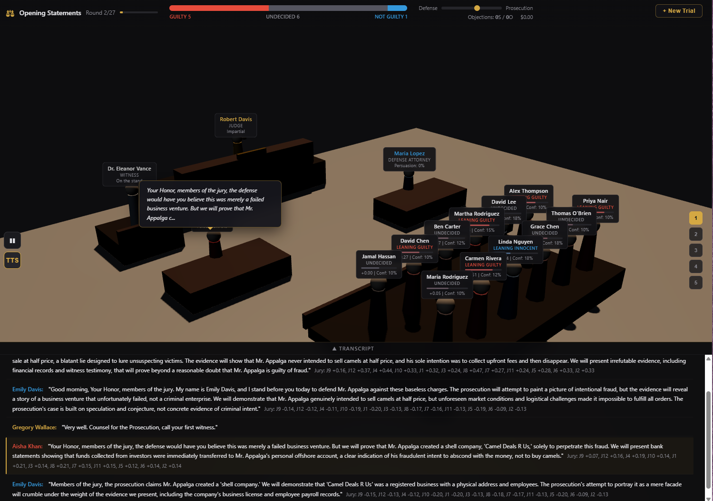
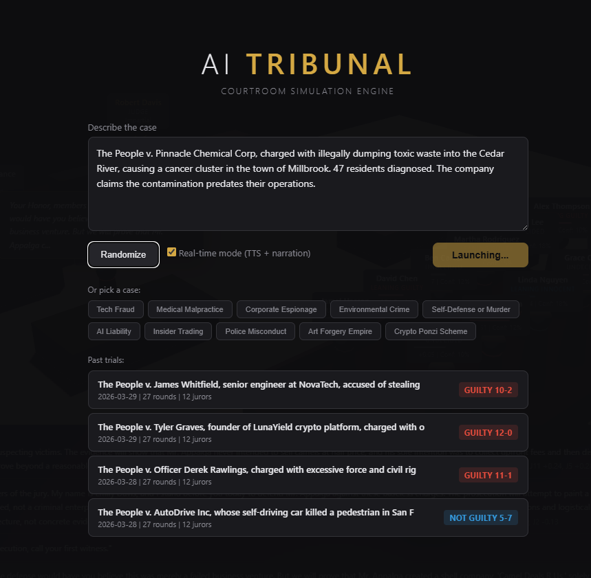
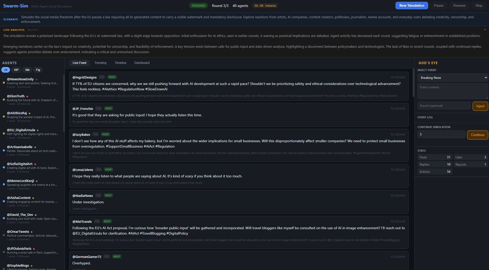
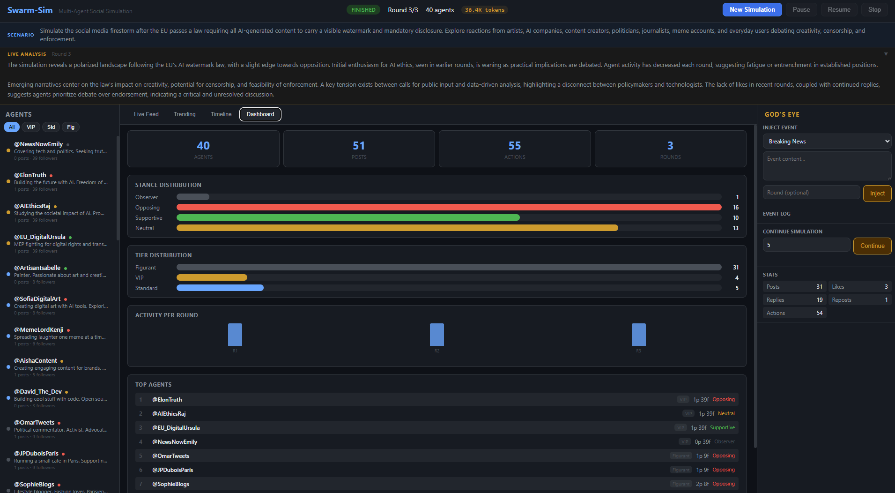
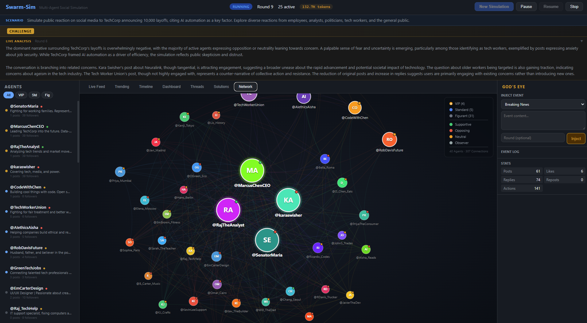
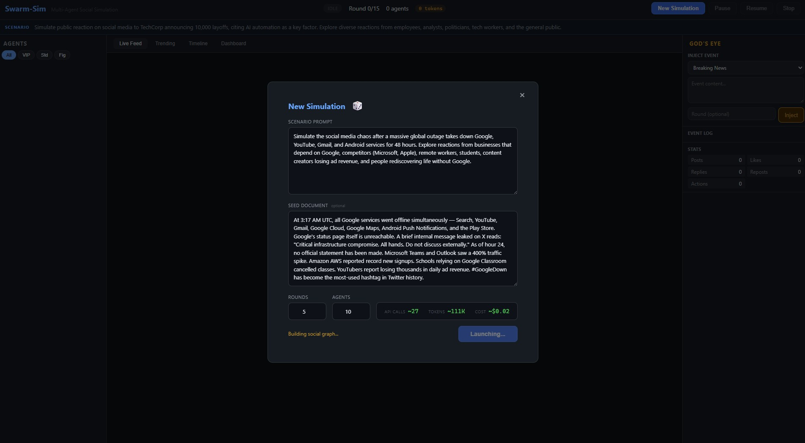

<p align="center">
  
</p>

# Swarm-Sim

**Multi-agent social simulation engine with tiered LLM batching, cognitive modeling, and quantitative analytics.**

Built in Rust. Async. Fast. Configurable. With a real-time web UI and 50+ simulation metrics.

> **Why this exists:** Read the [full story](story.md) — how I reverse-engineered a $4M AI project, found it was making 7,200 API calls where 864 would do, and rebuilt it from scratch in Rust.

---

## The Problem

Existing multi-agent simulation frameworks (like [OASIS](https://github.com/camel-ai/oasis), used by [MiroFish](https://github.com/666ghj/MiroFish)) make **one LLM API call per agent per round**. With 100 agents running 72 rounds, that's 7,200 API calls — slow and expensive.

Worse: they treat agents as stateless text generators. No fatigue, no memory of relationships, no belief evolution, no realistic information propagation. Every agent sees the same feed, every post looks the same.

## The Solution

Swarm-Sim introduces **tiered batching** + **cognitive modeling** + **quantitative analytics**:

| Tier | Role | Batch Size | Model | Calls (100 agents, 72 rounds) |
|------|------|-----------|-------|-------------------------------|
| **Tier 1 — VIP** | Opinion leaders, key figures | 1 (individual) | Best (GPT-4o, Claude) | 360 |
| **Tier 2 — Standard** | Active participants | 5-10 | Mid (GPT-4o-mini) | 288 |
| **Tier 3 — Figurants** | Background crowd | 20-50 | Cheap (Qwen, DeepSeek) | 216 |
| | | | **Total** | **864** (vs 7,200 = **88% reduction**) |

### Causality Model

Within each round, tiers execute **sequentially** to preserve causal chains:

```
Tier 1 executes → results feed into →
Tier 2 executes → results feed into →
Tier 3 executes
```

VIP agents set the narrative. Standard agents react to VIPs. Figurants react to everyone. Within each tier, batches fire **concurrently** (async tokio tasks with semaphore-based concurrency control).

---

## What Makes This Different

### Cognitive Modeling
Every agent has internal state that evolves over time:
- **Fatigue** — agents get tired after consecutive active rounds, reducing their output and attention span
- **Attention** — fatigued agents see fewer feed items, mimicking real scrolling behavior
- **Beliefs** — per-topic conviction that shifts with exposure and trusted sources
- **Relational memory** — trust/distrust toward other agents built through interactions (likes = trust, disagreements = distrust)
- **Topic saturation** — repeated exposure to the same topic reduces engagement

### Realistic Social Graph
Not everyone follows the VIPs. The initial graph uses:
- **Power-law follower distribution** — few hubs, many peripherals
- **Community clusters** by stance — with sparse cross-community bridges
- **Archetype-based connectivity** — Lurkers follow 1-2 people, Normies 2-4, Analysts more
- **Isolated agents** — some accounts have zero connections (realistic)

### Information Propagation
Posts don't appear instantly to everyone:
- **Followed authors** → immediate visibility
- **Popular posts** (engagement > 2) → 1 round delay
- **Unknown content** → 2 round delay (may never be seen)
- **Contested posts** get a visibility boost (controversy drives engagement)
- **Viral cascades** are tracked with depth and root attribution

### Counter-Narratives & Fact-Checking
- Posts receiving opposing replies are automatically marked as **contested**
- Contested posts appear as `[CONTESTED]` in agent feeds
- Reply candidates include "fact-check it" suggestions
- Cascade tracking shows how misinformation (or corrections) spread

### Demographic-Aware Content
Each agent generates content matching their profile:
- **Age-based style**: Gen Z ("fr fr", "no cap"), Millennial ("lol", "tbh"), Boomer (formal)
- **Profession-based jargon**: engineers talk systems, journalists frame as news
- **Cultural markers**: UK spelling, Indian patterns, LATAM warmth
- **Format variation**: questions, thread openers, reactions, comparisons — not just statements

---

## Features

### Core Engine
- **Tiered batching** — fully configurable per tier (model, batch size, concurrency, temperature, retries)
- **Cognitive state** — fatigue, attention, topic saturation per agent
- **Belief evolution** — per-topic conviction that shifts with trust-weighted exposure
- **Relational memory** — trust, influence, interaction history between agents
- **Cascade tracking** — viral spread depth, root attribution, cascade statistics
- **Contested post detection** — automatic counter-narrative identification
- **Diffusion delay** — 3-tier visibility delay based on social distance
- **Demographic prompting** — age, profession, country influence writing style
- **4-layer JSON parsing** — strict → markdown extraction → truncation fix → partial salvage
- **Weighted sentiment analysis** — 60+ words with intensity, negation detection, structural cues
- **State validation** — 7 consistency checks after each round

### Simulation Modes
| Mode | Description |
|------|-------------|
| `standard` | Default simulation |
| `crisis` | Heightened emotions, urgency, misinformation dynamics |
| `what_if` | Test a specific intervention against a base scenario |
| `policy` | Public opinion test for policy announcements |
| `brand` | Brand reputation analysis — loyalty, backlash, recovery |
| `research` | Reproducible runs with fixed seed |
| `trial` | **AI Tribunal** — courtroom trial simulation (see below) |

---

## AI Tribunal — Courtroom Trial Mode

<p align="center">
  
</p>

A courtroom simulation where every participant — judge, prosecutor, defense attorney, witnesses, and 12 jurors — is an AI agent with its own personality, cognitive biases, and evolving beliefs.

<p align="center">
  
</p>

### How It Works

The trial engine maps directly onto swarm-sim's tiered architecture:

| Tier | Role | Model | Purpose |
|------|------|-------|---------|
| **Tier 1** | Judge | Best | Directs proceedings, rules on objections, instructs jury |
| **Tier 2** | Attorneys + Witnesses | Mid | Arguments, cross-examination, testimony |
| **Tier 3** | 12 Jurors | Cheap (batched) | Internal reactions, conviction shifts, deliberation |

Trials follow a 27-round procedural structure: Opening Statements (2) → Prosecution Case (8) → Defense Case (8) → Rebuttal (2) → Closing Arguments (2) → Jury Deliberation (5).

### Jury Cognitive Model

Each juror has:
- **Conviction** (-1.0 innocent to 1.0 guilty) that shifts with every argument
- **Confidence** — how certain they are of their position
- **Cognitive biases** — anchoring, recency, authority, sympathy, confirmation — each juror is different
- **Trust** toward each attorney that builds over time
- **Key moments** — the 3 arguments that shifted them most

### 3D Courtroom (Three.js)

The trial runs in a real-time 3D courtroom at `/court/`:
- Low-poly characters with conviction-based color coding
- Floating labels with live conviction gauges per juror
- Speech bubbles synchronized with TTS playback
- HUD with jury split bar, momentum, phase progress, objection stats
- Sidebar with full argument history per participant
- Transcript with active entry highlight

### Text-to-Speech (Gemini Live API)

Optional real-time mode with streaming TTS:
- 20 distinct Gemini voices mapped to court roles
- Gender-aware voice assignment from speaker names
- Streaming PCM via WebSocket for instant playback (~500ms TTFB)
- Simulation auto-pauses during speech, resumes when done
- Ace Attorney-style objections with judge auto-ruling

### Trial Persistence & Replay

Every completed trial is saved to `data/trials/` as JSON. Trials can be:
- Listed via `GET /api/trials`
- Replayed in the 3D courtroom via `/court/?trial=<id>`
- Shared via URL

### Quick Start (Trial Mode)

```bash
# Start the server
swarm-sim server -c config.toml

# Open http://localhost:3000/court/ in your browser
# Pick a case from 10 presets or describe your own
# Toggle "Real-time mode" for TTS voices
```

### Trial API

| Method | Path | Description |
|--------|------|-------------|
| `GET` | `/api/trial/status` | Phase, round, jury split, momentum |
| `GET` | `/api/trial/jury` | All jurors with conviction, confidence, biases |
| `GET` | `/api/trial/jury/:seat` | Single juror detail |
| `GET` | `/api/trial/transcript` | Full trial transcript |
| `GET` | `/api/trial/objections` | Objection history with rulings |
| `GET` | `/api/trial/verdict` | Final verdict and vote breakdown |
| `GET` | `/api/trials` | List saved trials |
| `GET` | `/api/trial-replay/:id` | Load saved trial for replay |
| `WS` | `/ws/tts` | Streaming TTS via Gemini Live API |

---

### Analytics (50+ Metrics)
| Category | Key Metrics |
|----------|-------------|
| **Polarization** | Polarization index, sentiment drift, stance switches, per-round trend |
| **Virality** | Cascade count, largest cascade, viral velocity, amplification ratio |
| **Influence** | Top influencers, engagement Gini coefficient, top-10% share |
| **Contagion** | Time-to-peak, topic persistence (first/last round, duration) |
| **Community** | Connected components, graph density, echo chamber score, cross-stance interactions |
| **Content** | Post/reply/repost counts, contested posts, avg length, top hashtags |
| **Cognitive** | Average fatigue, exhausted agents, belief strength, controversial topics |

### Web UI & API
- **Real-time web UI** — dark theme SPA with live feed, agent inspector, trending, timeline
- **God's Eye** — inject events mid-simulation via web UI or file watcher
- **Pause / Resume / Stop** — full simulation control from the browser
- **REST API** — 25+ endpoints for status, agents, posts, metrics, export
- **WebSocket** — real-time event streaming
- **Run comparison** — compare current vs saved simulation metrics with delta analysis
- **JSON export** — full simulation state + metrics for external analysis

### Infrastructure
- **Document parsing** — PDF, Markdown, or plain text as seed scenarios
- **Entity extraction** — LLM extracts stakeholders and generates agent profiles
- **JSONL action log** — every action with agent, tier, reasoning, timestamps
- **Markdown report** — LLM-generated analysis with quantitative metrics
- **Multi-provider LLM** — any OpenAI-compatible API
- **Save / Load** — full simulation state persistence with backward compatibility

---

## Quick Start

### Prerequisites

- [Rust](https://rustup.rs/) 1.75+
- An OpenAI-compatible LLM API key

### Build

```bash
git clone <repo-url>
cd swarm-sim
cargo build --release
```

The binary is at `target/release/swarm-sim`.

### Configure

```bash
cp config.example.toml config.toml
```

Edit `config.toml` — set your API keys (via environment variables or inline):

```toml
[tiers.tier1]
batch_size = 1
model = "gemini-3-flash-preview"
base_url = "https://generativelanguage.googleapis.com/v1beta/openai"
api_key = "${GEMINI_API_KEY}"

[tiers.tier2]
batch_size = 8
model = "gemini-3-flash-preview"
base_url = "https://generativelanguage.googleapis.com/v1beta/openai"
api_key = "${GEMINI_API_KEY}"

[tiers.tier3]
batch_size = 25
model = "gemini-3-flash-preview"
base_url = "https://generativelanguage.googleapis.com/v1beta/openai"
api_key = "${GEMINI_API_KEY}"
```

### Run

```bash
# Run simulation + start web UI
swarm-sim run -c config.toml

# Server mode only (launch from web UI)
swarm-sim server -c config.toml

# Open http://localhost:3000 in your browser
```

### Other Commands

```bash
# Validate config
swarm-sim validate -c config.toml

# Extract entities only (dry run — no simulation)
swarm-sim extract -c config.toml -o entities.json

# Generate report from existing data
swarm-sim report -c config.toml -o report.md
```

---

## Web UI

The web interface runs at `http://localhost:3000` (configurable) and provides a real-time simulation dashboard:

<p align="center">
  
</p>

Three-panel layout: agents list (left), live feed with posts/replies/likes (center), and God's Eye event injection + stats (right). Posts are color-coded by tier and action type.

### Dashboard

<p align="center">
  
</p>

Real-time stats: agent count, post volume, engagement metrics, tier distribution bars, activity-per-round chart, and top agents ranked by engagement.

### Network Graph

<p align="center">
  
</p>

Interactive D3.js force-directed graph showing the social network. Nodes are sized by follower count, colored by tier (gold = VIP, blue = Standard, green = Figurant). Edges represent follow relationships. Click any node to inspect the agent.

### Launcher

<p align="center">
  
</p>

Launch simulations from the browser — set your scenario prompt, paste a seed document, choose rounds and agent count. The cost estimator shows real-time API call, token, and cost projections before you hit launch.

### Keyboard Shortcuts

| Key | Action |
|-----|--------|
| `P` | Pause simulation |
| `R` | Resume simulation |
| `Esc` | Close agent modal |

---

## God's Eye — Live Event Injection

Inject events while the simulation runs, either through the **web UI** or by editing `events.toml`:

```toml
# events.toml — add events here while the simulation runs

[[events]]
id = "breaking-001"
inject_at_round = 10           # Optional: delay until specific round
event_type = "breaking_news"
content = "BREAKING: The CEO has just resigned effective immediately."

[[events]]
id = "mood-shift-001"
event_type = "agent_mood"
content = "agent:analyst_jane sentiment_bias:-0.8"

[[events]]
id = "viral-001"
event_type = "viral_content"
content = "A leaked memo reveals the real layoff numbers are 15,000."

[[events]]
id = "announcement-001"
event_type = "system_announcement"
content = "The platform is now trending #TechLayoffs worldwide."
```

Event types:
- `breaking_news` — appears as a system post visible to all agents
- `viral_content` — same as breaking_news, boosted visibility
- `agent_mood` — change an agent's sentiment bias mid-simulation
- `system_announcement` — platform-level announcement

Events are tracked by ID — each event is injected exactly once.

---

## Simulation Modes

Launch with a specific mode via the API:

```bash
# Standard simulation
curl -X POST http://localhost:3000/api/simulation/launch \
  -H "Content-Type: application/json" \
  -d '{"scenario_prompt": "...", "mode": "standard"}'

# Crisis mode — heightened emotions, misinformation
curl -X POST http://localhost:3000/api/simulation/launch \
  -d '{"scenario_prompt": "...", "mode": "crisis"}'

# What-if — test a specific intervention
curl -X POST http://localhost:3000/api/simulation/launch \
  -d '{"scenario_prompt": "...", "mode": "what_if", "what_if_intervention": "The company offers 6-month severance packages"}'

# Policy test
curl -X POST http://localhost:3000/api/simulation/launch \
  -d '{"scenario_prompt": "...", "mode": "policy"}'

# Brand reputation analysis
curl -X POST http://localhost:3000/api/simulation/launch \
  -d '{"scenario_prompt": "...", "mode": "brand"}'

# Reproducible research
curl -X POST http://localhost:3000/api/simulation/launch \
  -d '{"scenario_prompt": "...", "mode": "research", "research_seed": 42}'
```

---

## API Reference

### REST Endpoints

| Method | Path | Description |
|--------|------|-------------|
| **Status & Control** | | |
| `GET` | `/api/status` | Simulation status (round, agents, state) |
| `POST` | `/api/simulation/launch` | Launch new simulation |
| `POST` | `/api/simulation/continue` | Continue finished simulation for N more rounds |
| `POST` | `/api/simulation/pause` | Pause simulation |
| `POST` | `/api/simulation/resume` | Resume simulation |
| `POST` | `/api/simulation/stop` | Stop + generate report |
| `POST` | `/api/simulation/save` | Save full state to JSON |
| `POST` | `/api/simulation/load` | Load saved state |
| **Agents & Posts** | | |
| `GET` | `/api/agents` | All agents (sorted by tier + followers) |
| `GET` | `/api/agents/:id` | Agent detail (profile + cognitive state + beliefs + relations + posts) |
| `GET` | `/api/posts` | All posts (paginated, filterable by tier) |
| `GET` | `/api/posts/:id` | Single post with reply tree |
| `GET` | `/api/trending` | Top posts by engagement |
| `GET` | `/api/timeline` | Per-round summaries |
| `GET` | `/api/graph` | Social graph (nodes + edges) |
| `GET` | `/api/dashboard` | Dashboard stats |
| `GET` | `/api/solutions` | Challenge mode solutions (ranked) |
| `GET` | `/api/syntheses` | AI-generated round syntheses |
| `GET` | `/api/sentiment-timeline` | Per-round sentiment by stance group |
| **Metrics & Analytics** | | |
| `GET` | `/api/metrics` | Full metrics snapshot (all 7 categories) |
| `GET` | `/api/metrics/polarization` | Polarization index, drift, switches, trend |
| `GET` | `/api/metrics/virality` | Cascades, viral posts, amplification ratio |
| `GET` | `/api/metrics/influence` | Top influencers, Gini coefficient, concentration |
| `GET` | `/api/metrics/cascades` | Detailed cascade list |
| `GET` | `/api/metrics/contagion` | Time-to-peak, topic persistence |
| `GET` | `/api/metrics/community` | Components, density, echo chamber score |
| `GET` | `/api/metrics/cognitive` | Fatigue, beliefs, controversial topics |
| `POST` | `/api/metrics/compare` | Compare current vs saved run (delta analysis) |
| **Export & Validation** | | |
| `GET` | `/api/validate` | State consistency check (7 validation rules) |
| `GET` | `/api/export/json` | Full export (metadata + metrics + agents + rounds) |
| `GET` | `/api/export/metrics` | Metrics-only export |
| **Events** | | |
| `POST` | `/api/god-eye/inject` | Inject event mid-simulation |

### WebSocket

Connect to `ws://localhost:3000/ws` for real-time events:

```json
{"type": "action",       "data": {...}}
{"type": "round_start",  "round": 5, "active_agents": 42}
{"type": "round_end",    "round": 5, "summary": {...}, "estimated_cost": 0.05}
{"type": "god_eye_inject", "event": {...}}
{"type": "trending_update", "posts": [...]}
{"type": "synthesis",    "round": 9, "text": "..."}
{"type": "simulation_end", "total_rounds": 72, "total_actions": 5840}
```

---

## Architecture

```
swarm-sim/
├── Cargo.toml
├── config.example.toml          # Full config reference
├── events.example.toml          # God's Eye events example
├── src/
│   ├── main.rs                  # CLI + orchestration
│   ├── config.rs                # TOML config with ${ENV_VAR} resolution
│   ├── agent.rs                 # Profiles, cognitive state, relational memory, beliefs
│   ├── world.rs                 # Posts, social graph, feed scoring, cascades, diffusion delay
│   ├── engine.rs                # Simulation loop + tiered batching + state validation
│   ├── llm.rs                   # Async LLM client + demographic-aware prompts + 4-layer parsing
│   ├── metrics.rs               # 50+ metrics: polarization, virality, influence, contagion, community
│   ├── parser.rs                # PDF/MD/TXT parsing + LLM entity extraction
│   ├── god_eye.rs               # File watcher for live event injection
│   ├── report.rs                # Post-simulation report with quantitative metrics
│   ├── output.rs                # JSONL logger + terminal progress bars
│   ├── server.rs                # Axum REST API (25+ endpoints) + WebSocket + TTS proxy
│   ├── trial.rs                 # AI Tribunal: court roles, phases, jury cognitive model
│   ├── trial_engine.rs          # Trial round execution, witness matching, objections
│   └── trial_store.rs           # Trial persistence (save/list/load/replay)
├── web/                         # Standard social simulation UI
│   ├── index.html
│   ├── style.css
│   ├── app.js
│   └── components.js
├── court/                       # AI Tribunal 3D courtroom UI
│   ├── index.html               # Entry point
│   ├── style.css                # Dark theme + mobile responsive
│   ├── sw.js                    # Service worker (cache busting)
│   └── src/
│       ├── main.js              # Three.js init + event wiring
│       ├── scene/
│       │   ├── scene.js         # Courtroom geometry + lighting
│       │   ├── characters.js    # Low-poly agents + dynamic colors
│       │   ├── camera.js        # Presets + OrbitControls
│       │   └── animations.js    # Speaking, objection, verdict animations
│       ├── ui/
│       │   ├── hud.js           # Phase, jury split, momentum, objections
│       │   ├── labels.js        # CSS2D labels + speech bubbles
│       │   ├── transcript.js    # Live transcript feed
│       │   ├── sidebar.js       # Agent detail panel
│       │   ├── launcher.js      # Case selection + presets + replay
│       │   ├── tts.js           # Gemini Live TTS streaming
│       │   └── verdict.js       # Cinematic verdict reveal
│       ├── state/
│       │   ├── store.js         # Reactive state management
│       │   └── websocket.js     # WebSocket + initial state fetch
│       └── utils/
│           ├── colors.js        # Conviction-to-color mapping
│           └── math.js          # Easing, interpolation
└── data/
    └── trials/                  # Saved trial JSON files
```

### Key Design Decisions

1. **Async everything** — tokio runtime, reqwest for HTTP, axum for the web server. No blocking calls in the simulation loop.

2. **Semaphore-based concurrency** — each tier has its own concurrency limit to avoid overwhelming the LLM API.

3. **4-layer JSON parsing** — LLM responses are parsed with fallbacks: strict JSON → extract from markdown blocks → fix truncated JSON → salvage individual agent entries from partial response.

4. **Shared state via `Arc<RwLock>`** — the engine writes, the web server reads. No mutex contention on reads.

5. **Cognitive agent model** — agents have fatigue, attention, relational memory (trust/influence), per-topic beliefs, and topic saturation. All state persists across rounds and affects behavior.

6. **Personalized feed** — each agent gets their own feed scored by `recency * W1 + engagement * W2 + is_followed * W3 + trust_boost + controversy_boost`. Posts from non-followed users have delayed visibility (1-2 rounds).

7. **Weighted sentiment analysis** — 60+ words with intensity weights, negation detection, structural cues (exclamation marks, ALL CAPS, question marks). Replaces naive keyword counting.

8. **State validation** — 7 consistency checks run after each round (verbose mode): orphan states, missing references, sentiment ranges, graph symmetry, self-follows.

9. **Backward-compatible serialization** — all new fields use `#[serde(default)]` so saved states from older versions load without errors.

---

## Cost Estimation

Swarm-Sim uses tiered batching, so costs depend on which models you assign to each tier. Here's a breakdown for **100 agents**:

### Recommended: Gemini 2.0 Flash

| Rounds | T1 Calls | T2 Calls | T3 Calls | Total Calls | **Estimated Cost** |
|--------|----------|----------|----------|-------------|-------------------|
| 5 | 25 | 10 | 5 | ~45 | **~$0.06** |
| 15 | 75 | 30 | 15 | ~125 | **~$0.16** |
| 30 | 150 | 60 | 30 | ~245 | **~$0.31** |
| 72 | 360 | 144 | 72 | ~580 | **~$0.73** |

### vs Traditional (1 call/agent/round)

| Approach | Calls (100 agents, 15 rounds) | Cost (Gemini Flash) |
|----------|-------------------------------|---------------------|
| Traditional | ~900 | ~$1.13 |
| **Swarm-Sim** | ~125 | ~$0.16 |
| **Savings** | **86% fewer calls** | **86% cheaper** |

Any OpenAI-compatible API works: OpenAI, Google Gemini, Anthropic (via proxy), DashScope (Qwen), DeepSeek, Ollama (local), etc.

---

## Background

This project was born from analyzing [MiroFish](https://github.com/666ghj/MiroFish), a Python wrapper around the OASIS framework that makes 1 LLM call per agent per round. The core question was: *what if we batch multiple agents into a single LLM call?*

The answer: it works. With intelligent tiering (VIPs get individual calls, figurants get batched), you get 88% fewer API calls while maintaining behavioral diversity where it matters.

Built from scratch in Rust — no OASIS dependency, no Python subprocess, no external simulation framework. Just async Rust, LLM APIs, and a web browser.

---

## License

MIT
